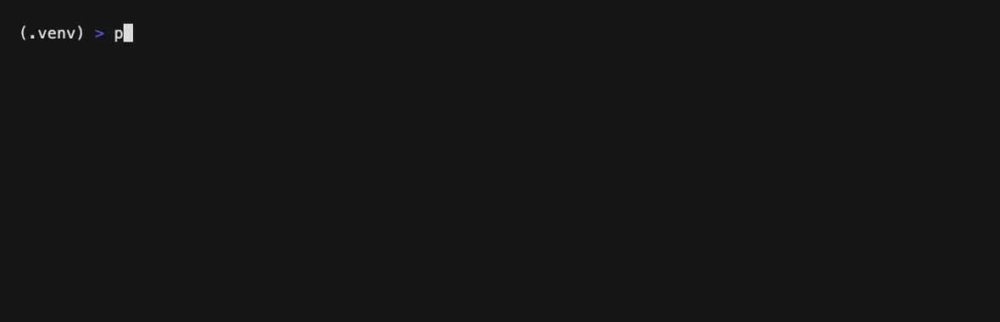
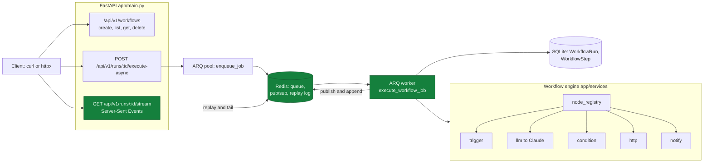

# AI Workflow API

Define multi-step workflows in YAML, run them asynchronously on a queue, and watch each step's progress stream live over SSE.

[](https://github.com/ChunkyTortoise/ai-workflow-api/actions/workflows/ci.yml)

[](LICENSE)

A FastAPI backend that turns a YAML file into a running workflow: an ARQ worker
executes the steps off a Redis queue, and a client can subscribe to a run and
receive `run_started`, per-step `step_completed`, and `run_completed` events as
they happen.



*A real run of the no-LLM `service_health_pipeline`: `execute-async` queues the
job, the worker streams step progress over SSE, the run completes in 6/6 steps.*

There is no public hosted demo. The Quickstart below is the review path
(and how the GIF was captured). Optional local UI: `streamlit run ui/app.py`.
Interactive docs: `http://localhost:8000/docs` after uvicorn is up.

## Quickstart

Run it locally (this is the path used to capture the GIF above):

```bash
pip install -r requirements.txt
cp .env.example .env                       # local defaults; API key only needed for llm nodes
redis-server &                             # or: docker run -p 6379:6379 redis:7-alpine
uvicorn app.main:app &                     # API on :8000
arq worker.worker.WorkerSettings &         # background worker
python scripts/stream_demo.py              # registers the demo workflow, runs it, streams progress
```

`scripts/stream_demo.py` reproduces the GIF. To drive it by hand with `curl`
(the stream replays the full log, so it works even after the run finishes):

```bash
# register the demo workflow; note the returned id
curl -sX POST localhost:8000/api/v1/workflows -H 'Content-Type: application/json' \
  -d "$(jq -n --rawfile y workflows/service_health_pipeline.yaml '{yaml_content:$y}')"
# trigger it, capture the run id, then stream
RUN=$(curl -sX POST localhost:8000/api/v1/runs/<workflow_id>/execute-async \
  -H 'Content-Type: application/json' -d '{"data":{}}' | jq -r .id)
curl -N localhost:8000/api/v1/runs/$RUN/stream
```

Docker alternative: `cp .env.example .env && docker compose up` brings up Redis,
the API, and the worker together.

## Architecture



The synchronous `POST /api/v1/runs/{id}/execute` runs a workflow inline and
returns the final result. `execute-async` enqueues the job on the ARQ worker
instead and returns a `run_id` immediately; the worker publishes progress to
Redis (both live pub/sub and an appended replay log), and `/stream` replays that
log from the start before tailing it, so a client that connects after a step (or
after a fast run completes) still receives the full event sequence.

## Measured metrics

All numbers come from real local runs on this branch.

| Metric | Value | Source |
|--------|-------|--------|
| Tests | 151 passing | `pytest tests/ -v` |
| Coverage | 79.5% | `pytest --cov=app` (CI fails under 75%) |
| Demo wall-clock | ~0.3s end-to-end in the GIF | no-LLM `service_health_pipeline` (6 steps); local Redis + worker |

Wall-clock is for the no-LLM demo pipeline only. LLM steps are dominated by
the model call. There is no committed latency bench script yet.

## SSE event shape

Each run emits a typed event sequence on `GET /api/v1/runs/{run_id}/stream`:

```
data: {"type": "run_started", "total_steps": 6, "status": "running"}
data: {"type": "step_completed", "step_id": "fetch_health", "node_type": "http", "status": "completed", "steps_completed": 2, "total_steps": 6, "progress": 33}
data: {"type": "run_completed", "status": "completed", "steps_completed": 6, "total_steps": 6}
```

## YAML workflows

A workflow is plain YAML. Drop a `.yaml` into `workflows/`, register it via
`POST /api/v1/workflows`, and it runs with no code changes.

```yaml
name: document_summary
description: Fetch a document by URL, summarize with Claude, and email the report
trigger:
  type: webhook
  path: /triggers/document_summary
steps:
  - id: fetch_doc
    type: http
    method: GET
    url: "{trigger.body.document_url}"
  - id: summarize
    type: llm
    model: claude-sonnet-4-6
    prompt: |
      Summarize this document with an executive summary, key findings,
      and action items.

      {fetch_doc.body}
  - id: send_report
    type: notify
    channel: email
    recipient: "{trigger.body.email}"
    message: "{summarize.content}"
```

Downstream steps read upstream output with `{step_id.field}` template syntax.

### Node types

| Type | Purpose | Key config |
|------|---------|------------|
| `trigger` | Entry point, passes webhook data into context | `path` |
| `llm` | Claude API call with a prompt template | `model`, `prompt`, `max_tokens` |
| `condition` | Branch on an expression, jump to `on_true`/`on_false` | `condition`, `on_true`, `on_false` |
| `http` | External HTTP request | `url`, `method`, `timeout` |
| `notify` | Notification (email / Slack / webhook channels, currently stubbed to logs) | `channel`, `recipient`, `message` |

### Built-in workflows

| Workflow | Steps | Purpose |
|----------|-------|---------|
| `document_summary` | http → llm → notify | Fetch a URL, summarize with Claude, email the report |
| `lead_qualification` | llm → condition → notify | Score a lead, route high scores to Slack, others to a nurture email |
| `support_triage` | llm → condition → notify | Triage a ticket, escalate urgent ones, queue the rest |
| `service_health_pipeline` | trigger → http → condition → notify → notify | No-LLM demo used for the SSE capture above |

## API reference

All workflow routes are under `/api/v1`.

| Method | Path | Description |
|--------|------|-------------|
| `GET` | `/health` | Health check |
| `POST` | `/api/v1/workflows` | Register a workflow from `{ "yaml_content": ... }` |
| `GET` | `/api/v1/workflows` | List workflows |
| `GET` | `/api/v1/workflows/{id}` | Workflow detail with parsed steps |
| `DELETE` | `/api/v1/workflows/{id}` | Delete a workflow |
| `POST` | `/api/v1/runs/{workflow_id}/execute` | Run synchronously, return the final result |
| `POST` | `/api/v1/runs/{workflow_id}/execute-async` | Enqueue on the worker, return `run_id` |
| `POST` | `/api/v1/runs/trigger/{path}` | Trigger by a workflow's webhook path |
| `GET` | `/api/v1/runs/{run_id}` | Run detail with per-step results |
| `GET` | `/api/v1/runs` | List runs, filter by `workflow_id` / `status` |
| `GET` | `/api/v1/runs/{run_id}/stream` | SSE progress stream (replays + tails) |
| `POST` | `/demo` | Mock demo payload for local UI smoke (not a live LLM run) |

## Tests

```bash
pytest tests/ -v    # 151 tests, fakeredis + respx, no live services required
```

Config comes from a `.env` file (`cp .env.example .env`): `ANTHROPIC_API_KEY`
for `llm` nodes, plus `REDIS_URL` and `DATABASE_URL`, which have local defaults.

## Tech stack

FastAPI · ARQ (async Redis queue) · Redis · SQLAlchemy async + SQLite ·
Anthropic Claude SDK · sse-starlette · Python 3.12. Deployable via `render.yaml`
(API + worker services) or `docker compose`.

## Project structure

```
app/
  main.py                 FastAPI app factory + lifespan (DB init, ARQ pool)
  config.py               pydantic-settings (env-based)
  models.py               async SQLAlchemy models (Workflow, WorkflowRun, WorkflowStep)
  events.py               Redis pub/sub + replay log for SSE
  routes/
    workflows.py          workflow CRUD
    runs.py               execute, execute-async, trigger, run list/detail
    stream.py             SSE stream (replay + tail)
  services/
    workflow_engine.py    YAML parser, step executor, condition branching
    node_registry.py      node-type registry
    claude_client.py      Anthropic SDK wrapper
    nodes/                trigger, llm, condition, http, notify
worker/worker.py          ARQ worker: execute_workflow_job (publishes progress)
workflows/                built-in YAML workflows
scripts/stream_demo.py    SSE demo used for the GIF
tests/                    151 tests
```

## License

[MIT](LICENSE). Copyright (c) 2026 Cayman Roden
